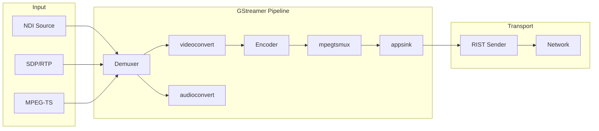
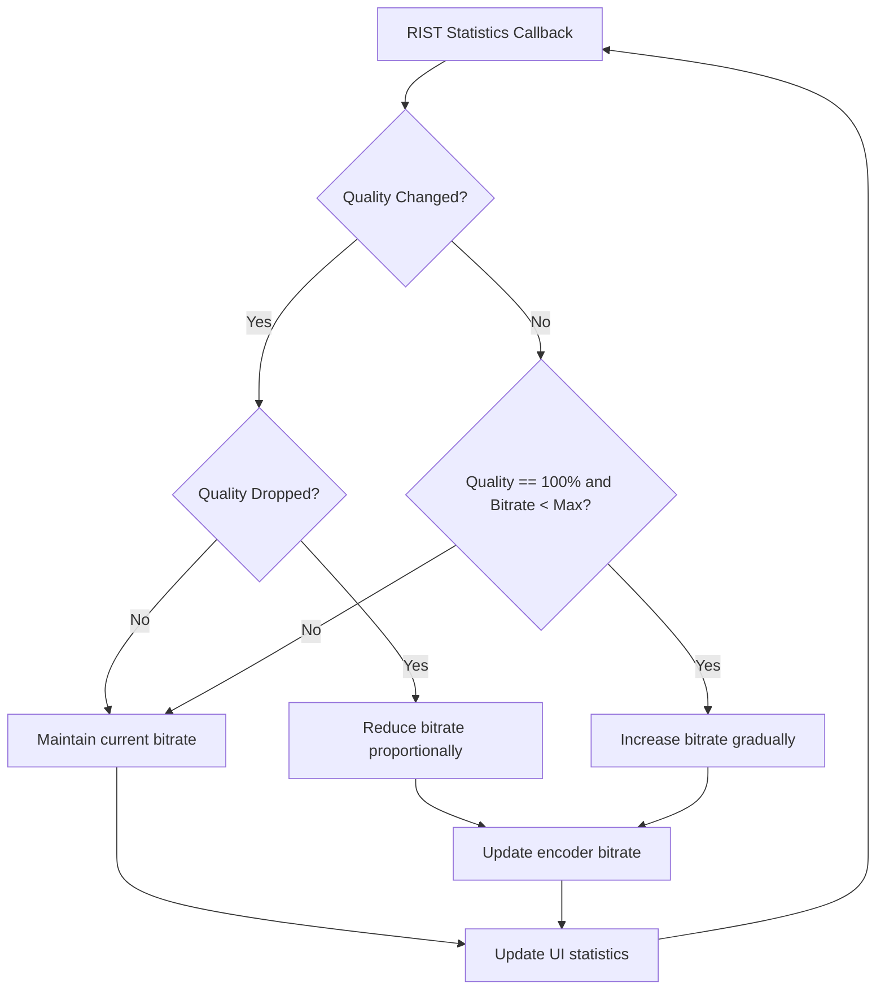

# AI Agent Guidelines for open-broadcast-encoder

## Project Overview

C++20 video streaming encoder with FLTK GUI, GStreamer pipelines, and RIST transport protocol.

**Input Sources**: SDP/RTP, NDI, MPEG-TS  
**Codecs**: H264, H265, AV1  
**Hardware Encoders**: AMD (AMF), Intel (QSV), NVIDIA (NVENC), Software (x264/x265/rav1e)

## Architecture

```
┌─────────────┐     ┌──────────────┐     ┌─────────────┐
│   UI (FLTK) │────▶│    lib.h     │◀────│  main.cpp   │
│    ui.h     │     │  (types)     │     │ (orchestrator)│
└─────────────┘     └──────────────┘     └─────────────┘
                            │                    │
         ┌──────────────────┼────────────────────┤
         ▼                  ▼                    ▼
┌─────────────┐    ┌──────────────┐    ┌─────────────┐
│ encode.h    │    │ transport.h  │   │ndi_input.h  │
│ (GStreamer) │    │  (RIST net)  │   │ (NDI monitor)│
└─────────────┘    └──────────────┘    └─────────────┘
                             │
                             ▼
                     ┌──────────────┐
                     │  stats.h     │
                     │ (bitrate adj)│
                     └──────────────┘
```

### Key Design Decisions

2. **Callback Pattern**: Components use function pointer callbacks for logging and events:
   ```cpp
   using log_func_ptr = void (*)(const std::string& msg);
   ```

3. **FLTK Threading**: All UI updates from background threads require locking:
   ```cpp
   ui.lock();        // Fl::lock()
   // ... update UI ...
   ui.unlock();      // Fl::unlock(); Fl::awake();
   ```

4. **Global State**: [`main.cpp`](source/main.cpp) uses global instances for cross-component communication:
   ```cpp
   library app;                          // Shared config/state
   std::unique_ptr<transport> transporter;
   user_interface ui;
   encode* ptr_encoder;                  // For bitrate adjustment callback
   ndi_input ndi(app.input_config, &encode_log);
   ```

## Build Commands

```bash
# Standard build
cmake -S . -B build -D CMAKE_BUILD_TYPE=Release
cmake --build build

# Developer mode (requires CMakeUserPresets.json)
cmake --preset=dev
cmake --build --preset=dev
ctest --preset=dev

# Code formatting
cmake --build build -t format-fix
cmake --build build -t format-check

# Run executable
cmake --build build -t run-exe
```

## Source File Organization

The project uses traditional C++ header/source file organization with .h and .cpp files:

| File | Purpose |
|------|---------|
| `source/lib/lib.h` | Header file containing declarations and inline/template code for shared types and configuration |
| `source/encode/encode.h` | Header file for the encode class (GStreamer pipeline management) |
| `source/encode/encode.cpp` | Implementation file for the encode class |
| `source/transport/transport.h` | Header file for the transport class (RIST protocol wrapper) |
| `source/transport/transport.cpp` | Implementation file for the transport class |
| `source/ui/ui.h` | Header file for the user_interface class (FLTK GUI) |
| `source/ui/ui.cpp` | Implementation file for the user_interface class |
| `source/ndi_input/ndi_input.h` | Header file for the ndi_input class (NDI source handling) |
| `source/ndi_input/ndi_input.cpp` | Implementation file for the ndi_input class |
| `source/stats/stats.h` | Header file for the stats module (RIST statistics and adaptive bitrate) |
| `source/stats/stats.cpp` | Implementation file for the stats module |

**Note**: `source/url/` contains a non-module URL parsing library (`url.h/url.cc`) used by transport.

### Include Pattern

Instead of C++20 module imports (`import library;`), the project uses traditional include statements:

```cpp
#include "lib.h"      // For shared types and configuration
#include "encode.h"   // For GStreamer pipeline management
#include "transport.h" // For RIST transport
#include "ui.h"       // For FLTK GUI
#include "ndi_input.h" // For NDI input
#include "stats.h"    // For adaptive bitrate statistics
```

## Coding Conventions

### clang-format
- Column limit: 80
- Indent width: 2 spaces
- Brace wrapping: Custom (after functions, classes, namespaces)
- Break binary operators: NonAssignment
- Pointer alignment: Left

Always run `cmake --build build -t format-fix` before committing.

### Naming Patterns
- **Types**: `snake_case` for structs (`input_config`, `encode_config`, `output_config`)
- **Classes**: `lowercase` (`encode`, `transport`, `user_interface`, `ndi_input`)
- **Functions**: `snake_case` (`run_encode_thread`, `setup_rist_sender`, `refresh_ndi_devices`)
- **Enums**: `snake_case` with `enum class` (`input_mode`, `codec`, `encoder`)

## Key Dependencies

| Dependency | Purpose | Source |
|------------|---------|--------|
| **GStreamer 1.24+** | Media pipelines | pkg-config (gstreamer-1.0, gstreamer-app-1.0, etc.) |
| **FLTK** | GUI framework | external/fltk (git submodule) |
| **NDI** | Network Device Interface | external/fltk + system NDI SDK |
| **rist-cpp** | RIST protocol wrapper | external/rist-cpp (git submodule) |
| **fmt** | Formatting library | vcpkg |

## GStreamer Pipeline Construction

The [`encode`](source/encode/encode.h:18) class builds pipelines dynamically using string formatting:

```cpp
pipeline_str = std::format(
    "udpsrc port={} ! tsdemux name=demux "
    "demux. ! queue ! videoconvert ! {} ! tsmux ",
    port, encoder_element);
datasrc_pipeline = gst_parse_launch(pipeline_str.c_str(), &error);
```

Pipeline elements are named for later retrieval:
```cpp
video_encoder = gst_bin_get_by_name(GST_BIN(datasrc_pipeline), "videncoder");
```

### Pipeline Building Pattern

The `encode` class uses a builder pattern with separate methods for each pipeline section:
- `pipeline_build_source()` - Input source (udpsrc, sdpsrc, ndisrc)
- `pipeline_build_sink()` - Output sink (appsink)
- `pipeline_build_video_demux()` - Video demuxer
- `pipeline_build_audio_demux()` - Audio demuxer
- `pipeline_build_video_encoder()` - Hardware/software encoder selection
- `pipeline_build_amd_encoder()`, `pipeline_build_qsv_encoder()`, etc.

### GStreamer Debugging

**Error Handling**: Pipeline errors are caught via the GStreamer bus message loop in [`play_pipeline()`](source/encode/encode.cpp:449):

```cpp
void encode::handle_gst_message_error(GstMessage* message)
{
  GError* err;
  gchar* debug_info;
  gst_message_parse_error(message, &err, &debug_info);
  log(std::format("Error received from element {}: {}\n",
                  GST_OBJECT_NAME(message->src), err->message));
  log(std::format("Debugging information: {}\n", debug_info));
}
```

**Pipeline Logging**: The full pipeline string is logged before parsing via [`log(this->pipeline_str)`](source/encode/encode.cpp:428). Check the encode log display in the UI to see the constructed pipeline.

**Environment Variables** for debugging GStreamer:
```bash
GST_DEBUG=3                    # Warning level logging
GST_DEBUG=4                    # Info level logging
GST_DEBUG=GST_PIPELINE:5       # Pipeline-specific debug
GST_DEBUG_DUMP_DOT_DIR=/tmp    # Export pipeline graphs as DOT files
```

**Common Issues**:
- Parse errors indicate malformed pipeline strings - check the logged pipeline string
- Missing elements: ensure GStreamer plugins are installed (e.g., `gstreamer1.0-plugins-bad` for NDI)
- State change failures: check if elements are properly linked

## Data Flow



### Data Flow Steps

1. **Input** → `ndi_input` or SDP/MPEGTS source → GStreamer demuxer
2. **Decode** → `videoconvert`/`audioconvert` → Encoder element
3. **Encode** → `h264parse`/`h265parse`/`av1parse` → `mpegtsmux`
4. **Output** → `appsink` → `pull_video_buffer()` → `transport::send_buffer()`
5. **Transport** → RIST sender → Network destination

## Adaptive Bitrate Logic



[`stats::got_rist_statistics()`](source/stats/stats.h:12) adjusts encode bitrate based on RIST link quality:

### Algorithm Details

1. **Quality Drop Detection**: When link quality changes from previous measurement:
   ```cpp
   qualDiffPct = statistics.stats.sender_peer.quality / stats->previous_quality;
   adjBitrate = (int)(stats->current_bitrate * qualDiffPct);
   bitrateDelta = adjBitrate - stats->current_bitrate;
   ```

2. **Gradual Increase**: When quality is 100% and below max bitrate:
   ```cpp
   qualDiffPct = (stats->current_bitrate / maxBitrate);
   adjBitrate = (int)(stats->current_bitrate * (1 + qualDiffPct));
   ```

3. **Rate Limiting**: Bitrate changes are dampened by dividing delta by 2:
   ```cpp
   int newBitrate = std::max(std::min(stats->current_bitrate += bitrateDelta / 2, (int)maxBitrate), 1000);
   ```

4. **Bounds**: Bitrate is clamped between 1000 kbps minimum and configured maximum.

5. **Statistics Tracking**: Maintains cumulative averages using online algorithm:
   ```cpp
   stats->bandwidth_avg = std::accumulate(stats->bandwidth.begin(), stats->bandwidth.end(), 0,
       [n = 0](auto cma, auto i) mutable { return cma + (i - cma) / ++n; });
   ```

### Callback Integration

The bitrate adjustment is triggered via RIST statistics callback in [`main.cpp`](source/main.cpp:58):
```cpp
static auto rist_stats_cb(const rist_stats& stats)
{
  if (stats::got_rist_statistics(stats, &app.stats, app.encode_config, ui)) {
    ptr_encoder->set_encode_bitrate(app.stats.current_bitrate);
  }
}
```

## External Submodules

Initialize before building:
```bash
git submodule update --init --recursive
```

Submodules:
- `external/fltk` - GUI toolkit
- `external/rist-cpp` - RIST protocol C++ wrapper

## Developer Workflows

### CMake Presets

Create `CMakeUserPresets.json` for developer mode:
```json
{
  "version": 2,
  "configurePresets": [{
    "name": "dev",
    "binaryDir": "${sourceDir}/build/dev",
    "inherits": ["dev-mode", "vcpkg", "ci-linux"],
    "cacheVariables": {"CMAKE_BUILD_TYPE": "Debug"}
  }],
  "buildPresets": [{
    "name": "dev",
    "configurePreset": "dev",
    "configuration": "Debug"
  }],
  "testPresets": [{
    "name": "dev",
    "configurePreset": "dev",
    "configuration": "Debug"
  }]
}
```

### Developer Mode Targets

Available when `open-broadcast-encoder_DEVELOPER_MODE` is enabled:
- `coverage` - Generate coverage reports
- `docs` - Build documentation with Doxygen
- `format-check` / `format-fix` - clang-format linting
- `run-exe` - Run the executable
- `spell-check` / `spell-fix` - codespell linting

### RIST URL Format

RIST URLs follow this pattern:
```
rist://{host}:{port}?bandwidth={bw}&buffer-min={min}&buffer-max={max}&rtt-min={min}&rtt-max={max}&reorder-buffer={buf}&timing-mode=2
```

Example:
```
rist://127.0.0.1:5000?bandwidth=6000&buffer-min=245&buffer-max=5000&rtt-min=40&rtt-max=500&reorder-buffer=240&timing-mode=2
```

## SDP Input Format

SDP strings follow RFC 4566 format. Example for raw video:
```
v=0
o=- 1443716955 1443716955 IN IP4 127.0.0.1
s=st2110 stream
t=0 0
a=recvonly

m=video 20000 RTP/AVP 102
c=IN IP4 127.0.0.1/8
a=rtpmap:102 raw/90000
a=fmtp:102 sampling=YCbCr-4:2:2; width=1920; height=1080; exactframerate=30000/1000; depth=10; TCS=SDR; colorimetry=BT709; PM=2110GPM; SSN=ST2110-20:2017; TP=2110TPN;
a=mediaclk:direct=0
a=ts-refclk:ptp=IEEE1588-2008:00-02-c5-ff-fe-21-60-5c:127
```

## FLTK UI Patterns

### Threading Model

FLTK requires all UI updates from background threads to use proper locking:

```cpp
// From background threads
ui.lock();                          // Fl::lock()
ui.bandwidth_output->value("...");  // Update UI elements
ui.unlock();                        // Fl::unlock(); Fl::awake();
```

The [`user_interface`](source/ui/ui.h:23) class provides helper methods:
- [`lock()`](source/ui/ui.cpp:554) - Calls `Fl::lock()`
- [`unlock()`](source/ui/ui.cpp:559) - Calls `Fl::unlock()` then `Fl::awake()`

### Callback Pattern

UI callbacks use FLTK's callback macros from `FL/fl_callback_macros.H`. The pattern uses `FL_METHOD_CALLBACK_N` macros to bind widget callbacks to class methods:

```cpp
// In init_ui_callbacks() - binds choice_input_protocol to choose_input_protocol method
FL_METHOD_CALLBACK_2(choice_input_protocol,
                     user_interface,    // Class type
                     this,              // Instance
                     choose_input_protocol,  // Method name
                     input_config*,    // Argument 1 type
                     input_c,          // Argument 1 value
                     FuncPtr,          // Argument 2 type
                     ndi_refresh_funcptr);  // Argument 2 value
```

### Menu Item Pattern

Menu items store enum values as `user_data` for type-safe selection:

```cpp
// In ui.h - menu item definition
Fl_Menu_Item user_interface::menu_choice_encoder[] = {
    {"AMD", 0, 0, (void*)(static_cast<long>(encoder::amd)), ...},
    {"NVENC", 0, 0, (void*)(static_cast<long>(encoder::nvenc)), ...},
    ...
};

// Retrieving selection
auto user_data = reinterpret_cast<uintptr_t>(choice_encoder->mvalue()->user_data());
encode_config->encoder = static_cast<encoder>(user_data);
```

### UI Initialization Flow

1. [`init_ui()`](source/ui/ui.cpp:548) - Sets up FLTK visual mode and threading (`Fl::lock()`)
2. [`user_interface()`](source/ui/ui.h:23) constructor - Builds widget hierarchy
3. [`init_ui_callbacks()`](source/ui/ui.cpp:705) - Binds callbacks to widgets
4. [`show()`](source/ui/ui.cpp:518) - Displays the main window
5. [`run_ui()`](source/ui/ui.cpp:565) - Enters FLTK main loop (`Fl::run()`)

## NDI Input

NDI input uses GStreamer's `ndisrc` element:
```cpp
pipeline_str = std::format(
    "ndisrc do-timestamp=true ndi-name=\"{}\" ! ndisrcdemux name=demux ",
    input_c.selected_input);
```

Device discovery uses `gst_device_monitor`:
```cpp
device_monitor = gst_device_monitor_new();
gst_device_monitor_add_filter(device_monitor, "Video/Source", caps);
gst_device_monitor_start(device_monitor);
```

## RIST Transport

The [`transport`](source/transport/transport.h:14) module wraps `rist-cpp` for RIST protocol:
- `setup_rist_sender()` - Initialize sender with URL configuration
- `send_buffer()` - Send video buffer data
- `set_log_callback()` / `set_statistics_callback()` - Event callbacks

### Configuration Parameters

The [`output_config`](source/lib/lib.h:68) struct defines RIST settings:

| Parameter | Default | Description |
|-----------|---------|-------------|
| `address` | `127.0.0.1:5000` | Destination host:port |
| `streams` | `1` | Number of parallel streams |
| `bandwidth` | `6000` | Max bandwidth in kbps |
| `buffer_min` | `245` | Minimum buffer size in ms |
| `buffer_max` | `5000` | Maximum buffer size in ms |
| `rtt_min` | `40` | Minimum RTT in ms |
| `rtt_max` | `500` | Maximum RTT in ms |
| `reorder_buffer` | `240` | Reorder buffer size in ms |

### URL Construction

RIST URLs are constructed dynamically in [`setup_rist_sender()`](source/transport/transport.cpp:82):

```cpp
string rist_output_url = std::format(
    "rist://{}:{}?bandwidth={}&buffer-min={}&buffer-max={}&rtt-min={}&rtt-max={}&"
    "reorder-buffer={}&timing-mode=2",
    url.getHost(),
    url.getPort() + (2 * i),  // Port offset for multiple streams
    output_c.bandwidth,
    output_c.buffer_min,
    output_c.buffer_max,
    output_c.rtt_min,
    output_c.rtt_max,
    output_c.reorder_buffer);
```

### Multiple Streams

When `streams > 1`, the transport creates multiple RIST connections with port offsets:
- Stream 0: base port
- Stream 1: base port + 2
- Stream N: base port + (2 * N)

### RIST Profile Settings

```cpp
my_send_configuration.mLogLevel = RIST_LOG_DEBUG;
my_send_configuration.mProfile = RIST_PROFILE_ADVANCED;
```

- `RIST_PROFILE_ADVANCED` enables all RIST features including encryption and bonding
- Statistics callback is bound via `std::bind_front` for member function callback

## Stats Module

The [`stats`](source/stats/stats.h:1) module handles RIST statistics and adaptive bitrate:
- `got_rist_statistics()` - Process RIST stats and adjust bitrate
- Tracks bandwidth, retransmitted packets, total packets
- Updates UI with cumulative statistics

## Common Patterns

### Adding a New Encoder

1. Add enum value to [`encoder`](source/lib/lib.h:27) in `lib.h`
2. Add menu item to [`menu_choice_encoder`](source/ui/ui.h:189) in `ui.h`
3. Implement `pipeline_build_<vendor>_<codec>_encoder()` methods in [`encode.cpp`](source/encode/encode.cpp)
4. Wire up the switch case in `pipeline_build_<vendor>_encoder()`

### Adding a New Input Source

1. Add enum value to [`input_mode`](source/lib/lib.h:12) in `lib.h`
2. Add menu item to [`menu_choice_input_protocol`](source/ui/ui.h:106) in `ui.h`
3. Implement source building in `pipeline_build_source()` in [`encode.cpp`](source/encode/encode.cpp:107)
4. Handle demux in `pipeline_build_video_demux()` and `pipeline_build_audio_demux()`
