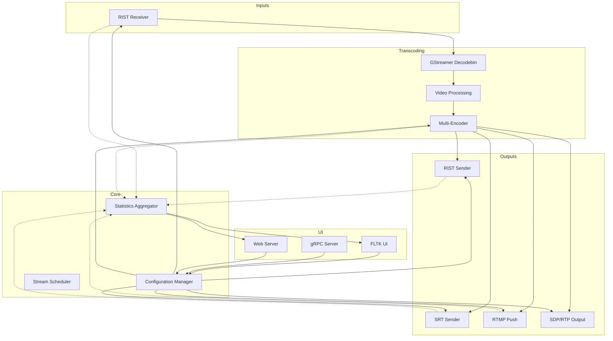
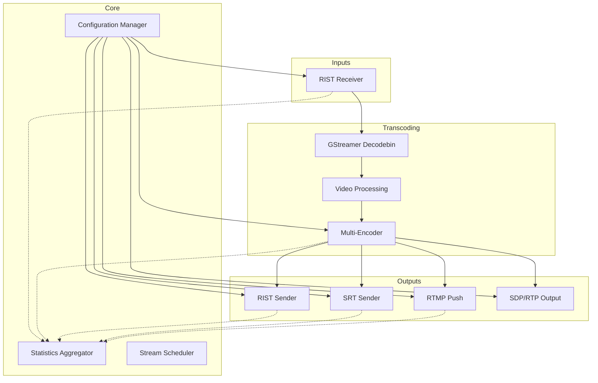
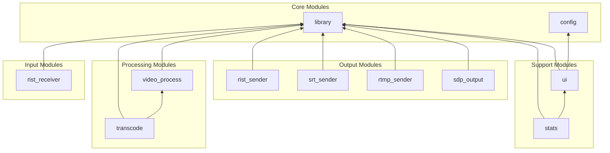
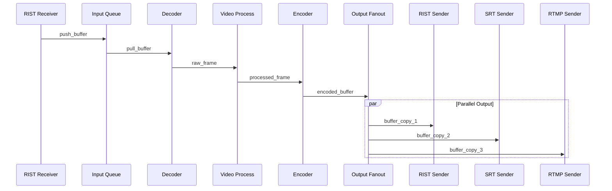
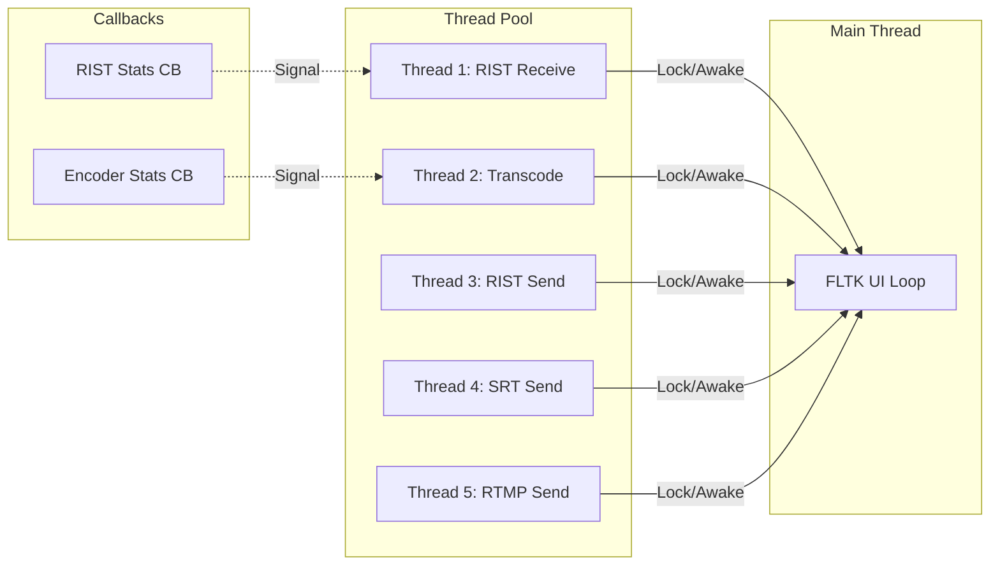
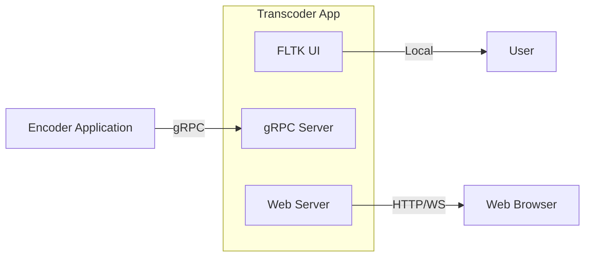
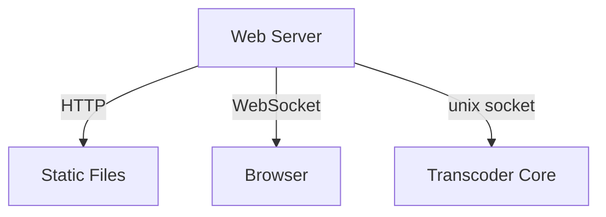
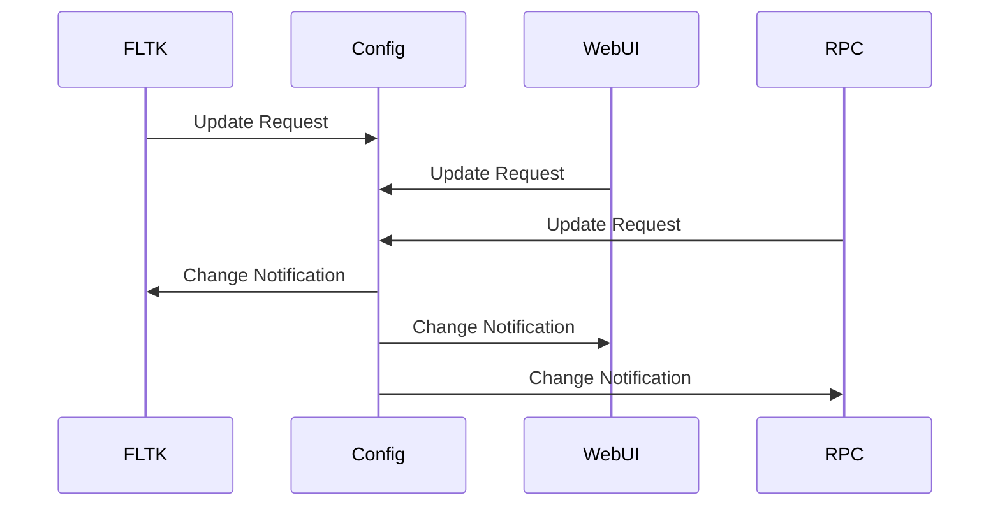

# RIST Receiver/Transcoder/Restreamer Architecture

## Executive Summary

This document describes the architecture for a new C++20 application that receives RIST streams from `open-broadcast-encoder`, transcodes video content, and restreams to multiple destinations via RIST, SRT, RTMP, or SDP outputs.

The application features three UI modes:
1. **Local FLTK UI**: Integrated GUI for direct monitoring and control
2. **RPC Control Interface**: gRPC-based API for encoder app integration
3. **Web UI**: Browser-based interface for remote management


---

## 1. High-Level Architecture





### Component Overview

| Component | Responsibility |
|-----------|---------------|
| **rist_receiver** | Receive RIST streams, manage connections, provide buffers |
| **transcode** | GStreamer pipeline for decode/process/encode |
| **rist_sender** | RIST output compatible with open-broadcast-encoder |
| **srt_sender** | SRT/Haivision protocol output |
| **rtmp_sender** | RTMP push to streaming platforms |
| **sdp_output** | Raw RTP/SDP output |
| **library** | Shared types, configuration, state management |
| **stats** | Statistics aggregation and reporting |
| **ui** | FLTK-based graphical interface |
| **rpc_server** | gRPC service implementation |
| **web_server** | Web UI backend and API |


| Component | Responsibility |
|-----------|---------------|
| **rist_receiver** | Receive RIST streams, manage connections, provide buffers |
| **transcode** | GStreamer pipeline for decode/process/encode |
| **rist_sender** | RIST output compatible with open-broadcast-encoder |
| **srt_sender** | SRT/Haivision protocol output |
| **rtmp_sender** | RTMP push to streaming platforms |
| **sdp_output** | Raw RTP/SDP output |
| **library** | Shared types, configuration, state management |
| **stats** | Statistics aggregation and reporting |
| **ui** | FLTK-based graphical interface |

---

## 2. Module Structure

Following the existing `open-broadcast-encoder` patterns, all modules use `.cppm` extension with C++20 modules.

### Module Dependency Graph



### Module Definitions

#### Core Modules

| Module | File | Export Name | Purpose |
|--------|------|-------------|---------|
| `library` | `source/lib/lib.cppm` | `library` | Shared types, enums, structs |
| `config` | `source/config/config.cppm` | `config` | Configuration management, JSON parsing |

#### Input Modules

| Module | File | Export Name | Purpose |
|--------|------|-------------|---------|
| `rist_receiver` | `source/rist_receiver/rist_receiver.cppm` | `rist_receiver` | RIST stream reception |

#### Processing Modules

| Module | File | Export Name | Purpose |
|--------|------|-------------|---------|
| `transcode` | `source/transcode/transcode.cppm` | `transcode` | GStreamer transcoding pipeline |
| `video_process` | `source/video_process/video_process.cppm` | `video_process` | Video filters and processing |

#### Output Modules

| Module | File | Export Name | Purpose |
|--------|------|-------------|---------|
| `rist_sender` | `source/rist_sender/rist_sender.cppm` | `rist_sender` | RIST output transport |
| `srt_sender` | `source/srt_sender/srt_sender.cppm` | `srt_sender` | SRT output transport |
| `rtmp_sender` | `source/rtmp_sender/rtmp_sender.cppm` | `rtmp_sender` | RTMP output transport |
| `sdp_output` | `source/sdp_output/sdp_output.cppm` | `sdp_output` | SDP/RTP output |

#### Support Modules

| Module | File | Export Name | Purpose |
|--------|------|-------------|---------|
| `stats` | `source/stats/stats.cppm` | `stats` | Statistics aggregation |
| `ui` | `source/ui/ui.cppm` | `ui` | FLTK user interface |
| `rpc_server` | `source/rpc_server/rpc_server.cppm` | `rpc_server` | gRPC service implementation |
| `web_server` | `source/web_server/web_server.cppm` | `web_server` | Web UI backend |


#### Core Modules

| Module | File | Export Name | Purpose |
|--------|------|-------------|---------|
| `library` | `source/lib/lib.cppm` | `library` | Shared types, enums, structs |
| `config` | `source/config/config.cppm` | `config` | Configuration management, JSON parsing |

#### Input Modules

| Module | File | Export Name | Purpose |
|--------|------|-------------|---------|
| `rist_receiver` | `source/rist_receiver/rist_receiver.cppm` | `rist_receiver` | RIST stream reception |

#### Processing Modules

| Module | File | Export Name | Purpose |
|--------|------|-------------|---------|
| `transcode` | `source/transcode/transcode.cppm` | `transcode` | GStreamer transcoding pipeline |
| `video_process` | `source/video_process/video_process.cppm` | `video_process` | Video filters and processing |

#### Output Modules

| Module | File | Export Name | Purpose |
|--------|------|-------------|---------|
| `rist_sender` | `source/rist_sender/rist_sender.cppm` | `rist_sender` | RIST output transport |
| `srt_sender` | `source/srt_sender/srt_sender.cppm` | `srt_sender` | SRT output transport |
| `rtmp_sender` | `source/rtmp_sender/rtmp_sender.cppm` | `rtmp_sender` | RTMP output transport |
| `sdp_output` | `source/sdp_output/sdp_output.cppm` | `sdp_output` | SDP/RTP output |

#### Support Modules

| Module | File | Export Name | Purpose |
|--------|------|-------------|---------|
| `stats` | `source/stats/stats.cppm` | `stats` | Statistics aggregation |
| `ui` | `source/ui/ui.cppm` | `ui` | FLTK user interface |

---

## 3. Data Flow

### Primary Data Path



### Buffer Management Strategy

```
┌─────────────────────────────────────────────────────────────────┐
│                      Buffer Lifecycle                           │
├─────────────────────────────────────────────────────────────────┤
│                                                                 │
│  RIST Receiver ──► Input Buffer Pool ──► GStreamer Pipeline    │
│                           │                                     │
│                           ▼                                     │
│                    [Recycle to Pool] ◄── Appsink Release       │
│                                                                 │
│  GStreamer Appsink ──► Output Buffer ──► Output Fanout         │
│                              │                                  │
│                              ▼                                  │
│                    [Reference Counted]                          │
│                    [Released when all outputs complete]          │
│                                                                 │
└─────────────────────────────────────────────────────────────────┘
```

### Threading Model



---

## 4. Class and Component Design

### 4.1 Core Types Module - library

```cpp
// source/lib/lib.cppm
export module library;

// Input configuration
export enum class input_protocol : std::uint8_t
{
  rist
};

export struct rist_input_config
{
  std::string listen_address = "0.0.0.0";
  uint16_t listen_port = 5000;
  int buffer_min = 245;
  int buffer_max = 5000;
  int rtt_min = 40;
  int rtt_max = 500;
  int reorder_buffer = 240;
  int bandwidth = 6000;
  std::string psk = "";  // Optional encryption
};

// Transcode configuration
export enum class codec : std::uint8_t
{
  h264,
  h265,
  av1
};

export enum class encoder : std::uint8_t
{
  amd,      // AMF
  qsv,      // Intel Quick Sync
  nvenc,    // NVIDIA
  software  // x264/x265/rav1e
};

export struct transcode_config
{
  codec output_codec = codec::h264;
  encoder encoder_type = encoder::software;
  int bitrate_kbps = 4300;
  std::optional<int> width;     // Scale if set
  std::optional<int> height;    // Scale if set
  std::optional<std::string> overlay_path;
  bool deinterlace = false;
};

// Output configuration
export enum class output_protocol : std::uint8_t
{
  rist,
  srt,
  rtmp,
  sdp
};

export struct output_destination
{
  std::string name;              // User-friendly name
  output_protocol protocol;
  std::string address;
  int bitrate_kbps = 4300;       // Per-destination bitrate
  codec codec = codec::h264;     // Per-destination codec
  encoder encoder_type = encoder::software;
  bool enabled = true;
  
  // Protocol-specific options
  std::optional<std::string> rtmp_stream_key;
  std::optional<std::string> srt_mode;  // caller/listener
  std::optional<int> srt_latency_ms;
};

export struct output_config
{
  std::vector<output_destination> destinations;
};

// Buffer type for inter-module communication
export struct buffer_data
{
  size_t buf_size {0};
  uint8_t* buf_data {};
  uint64_t seq {0};
  uint64_t ts_ntp {0};
  uint16_t stream_id {0};
};

// Statistics types
export struct stream_stats
{
  uint64_t bytes_received = 0;
  uint64_t bytes_sent = 0;
  uint64_t packets_lost = 0;
  uint64_t packets_retransmitted = 0;
  double link_quality = 0.0;
  int current_bitrate_kbps = 0;
  double encode_fps = 0.0;
  int rtt_ms = 0;
};

export struct cumulative_stats
{
  std::vector<stream_stats> input_stats;
  std::vector<stream_stats> output_stats;
  std::map<std::string, stream_stats> per_destination_stats;
};

// Main application state
export struct library
{
  library() noexcept;
  
  std::atomic_bool is_running;
  std::vector<std::thread> threads;
  
  rist_input_config input_config;
  transcode_config transcode_config;
  output_config output_config;
  cumulative_stats stats;
  
  void log_append(const std::string& msg) const;
};
```

### 4.2 RIST Receiver Module

```cpp
// source/rist_receiver/rist_receiver.cppm
export module rist_receiver;
import library;

using log_func_ptr = void (*)(const std::string& msg);
using buffer_callback_ptr = void (*)(const buffer_data& buf);

export class rist_receiver
{
public:
  rist_receiver(const rist_input_config& config, 
                log_func_ptr log_func,
                buffer_callback_ptr buffer_cb);
  ~rist_receiver();
  
  void start();
  void stop();
  
  // Statistics access
  stream_stats get_stats() const;
  
  // Connection management
  std::vector<std::string> get_connected_senders() const;
  
  void set_log_callback(log_func_ptr callback);
  void set_statistics_callback(void (*callback)(const rist_stats&));

private:
  RISTNetReceiver* receiver;
  const rist_input_config& config;
  log_func_ptr log_func;
  buffer_callback_ptr buffer_cb;
  std::atomic_bool running;
  
  void handle_received_data(const uint8_t* data, size_t size);
  void handle_statistics(const rist_stats& stats);
};
```

### 4.3 Transcode Module

```cpp
// source/transcode/transcode.cppm
export module transcode;
import library;

using log_func_ptr = void (*)(const std::string& msg);

export class transcode
{
public:
  transcode(const transcode_config& config,
            log_func_ptr log_func);
  ~transcode();
  
  // Input from RIST receiver
  void push_input_buffer(const buffer_data& buf);
  
  // Output for fanout - non-blocking pull
  std::optional<buffer_data> pull_output_buffer();
  
  // Dynamic reconfiguration
  void set_bitrate(int bitrate_kbps);
  void set_codec(codec c, encoder e);
  
  // Statistics
  double get_encode_fps() const;
  int get_current_bitrate() const;
  
  void start();
  void stop();

private:
  GstElement* pipeline;
  GstElement* appsrc;      // Input from RIST
  GstElement* appsink;     // Output to fanout
  GstElement* video_encoder;
  
  const transcode_config& config;
  log_func_ptr log_func;
  std::atomic_bool running;
  
  void build_pipeline();
  void build_decoder();
  void build_processor();
  void build_encoder();
  void handle_gst_message(GstMessage* msg);
};
```

### 4.4 Output Fanout Module

```cpp
// source/output_fanout/output_fanout.cppm
export module output_fanout;
import library;
import rist_sender;
import srt_sender;
import rtmp_sender;
import sdp_output;

export class output_fanout
{
public:
  output_fanout(const output_config& config,
                log_func_ptr log_func);
  ~output_fanout();
  
  // Add/remove destinations at runtime
  void add_destination(const output_destination& dest);
  void remove_destination(const std::string& name);
  void enable_destination(const std::string& name, bool enabled);
  
  // Push buffer to all enabled destinations
  void distribute_buffer(const buffer_data& buf);
  
  // Per-destination statistics
  std::map<std::string, stream_stats> get_all_stats() const;
  
  void start_all();
  void stop_all();

private:
  struct destination_handle
  {
    output_destination config;
    std::unique_ptr<rist_sender> rist;
    std::unique_ptr<srt_sender> srt;
    std::unique_ptr<rtmp_sender> rtmp;
    std::unique_ptr<sdp_output> sdp;
    bool enabled;
  };
  
  std::vector<destination_handle> destinations;
  log_func_ptr log_func;
  std::mutex destinations_mutex;
};
```

### 4.5 RIST Sender Module

```cpp
// source/rist_sender/rist_sender.cppm
export module rist_sender;
import library;

export class rist_sender
{
public:
  rist_sender(const output_destination& dest,
              log_func_ptr log_func);
  ~rist_sender();
  
  void send_buffer(const buffer_data& buf);
  
  void set_bitrate(int bitrate_kbps);
  stream_stats get_stats() const;
  
  void start();
  void stop();
  
  void set_statistics_callback(void (*callback)(const rist_stats&));

private:
  RISTNetSender* sender;
  output_destination dest;
  log_func_ptr log_func;
  stream_stats stats;
};
```

### 4.6 SRT Sender Module

```cpp
// source/srt_sender/srt_sender.cppm
export module srt_sender;
import library;

export class srt_sender
{
public:
  srt_sender(const output_destination& dest,
             log_func_ptr log_func);
  ~srt_sender();
  
  void send_buffer(const buffer_data& buf);
  
  void set_bitrate(int bitrate_kbps);
  stream_stats get_stats() const;
  
  void start();
  void stop();

private:
  SRTSOCKET socket;
  output_destination dest;
  log_func_ptr log_func;
  stream_stats stats;
};
```

### 4.7 RTMP Sender Module

```cpp
// source/rtmp_sender/rtmp_sender.cppm
export module rtmp_sender;
import library;

export class rtmp_sender
{
public:
  rtmp_sender(const output_destination& dest,
              log_func_ptr log_func);
  ~rtmp_sender();
  
  void send_buffer(const buffer_data& buf);
  
  stream_stats get_stats() const;
  
  void start();
  void stop();

private:
  // Uses GStreamer pipeline: appsrc ! flvmux ! rtmpsink
  GstElement* pipeline;
  GstElement* appsrc;
  output_destination dest;
  log_func_ptr log_func;
  stream_stats stats;
};
```

---

## 5. Configuration Schema

### 5.1 JSON Configuration File

```json
{
  "version": "1.0",
  "input": {
    "protocol": "rist",
    "listen_address": "0.0.0.0",
    "listen_port": 5000,
    "buffer_min": 245,
    "buffer_max": 5000,
    "rtt_min": 40,
    "rtt_max": 500,
    "reorder_buffer": 240,
    "bandwidth": 6000,
    "psk": ""
  },
  "transcode": {
    "codec": "h264",
    "encoder": "nvenc",
    "bitrate_kbps": 4300,
    "scale": {
      "width": 1920,
      "height": 1080
    },
    "deinterlace": false,
    "overlay": null
  },
  "outputs": [
    {
      "name": "Primary RIST",
      "protocol": "rist",
      "address": "192.168.1.100:6000",
      "bitrate_kbps": 4300,
      "codec": "h264",
      "encoder": "nvenc",
      "enabled": true
    },
    {
      "name": "YouTube RTMP",
      "protocol": "rtmp",
      "address": "rtmp://a.rtmp.youtube.com/live2",
      "rtmp_stream_key": "xxxx-xxxx-xxxx-xxxx",
      "bitrate_kbps": 6000,
      "codec": "h264",
      "encoder": "nvenc",
      "enabled": true
    },
    {
      "name": "Backup SRT",
      "protocol": "srt",
      "address": "backup.example.com:9000",
      "srt_mode": "caller",
      "srt_latency_ms": 500,
      "bitrate_kbps": 3000,
      "codec": "h264",
      "encoder": "software",
      "enabled": false
    }
  ]
}
```

### 5.2 Configuration Structs

```cpp
// source/config/config.cppm
export module config;
import library;
import <nlohmann/json.hpp>;

export struct app_config
{
  rist_input_config input;
  transcode_config transcode;
  output_config outputs;
  
  static app_config from_json(const std::string& path);
  void to_json(const std::string& path) const;
  void validate() const;
};

// JSON serialization
export void to_json(nlohmann::json& j, const rist_input_config& c);
export void from_json(const nlohmann::json& j, rist_input_config& c);

export void to_json(nlohmann::json& j, const transcode_config& c);
export void from_json(const nlohmann::json& j, transcode_config& c);

export void to_json(nlohmann::json& j, const output_destination& d);
export void from_json(const nlohmann::json& j, output_destination& d);
```

---

## 6. Technology Choices

### 6.1 Core Dependencies

| Dependency | Version | Purpose | Rationale |
|------------|---------|---------|-----------|
| **GStreamer** | 1.24+ | Media pipeline | Consistent with open-broadcast-encoder, mature, plugin ecosystem |
| **rist-cpp** | git submodule | RIST protocol | Direct compatibility with open-broadcast-encoder |
| **libsrt** | 1.5.x | SRT protocol | Industry standard for SRT, used by Haivision |
| **librtmp** | system | RTMP protocol | Standard RTMP implementation |
| **FLTK** | 1.4.x | GUI framework | Consistent with open-broadcast-encoder |
| **fmt** | 10.x | Formatting | Modern C++ formatting, vcpkg available |
| **nlohmann/json** | 3.x | JSON parsing | Header-only, widely used |
| **vcpkg** | - | Package manager | Consistent with open-broadcast-encoder |

### 6.2 GStreamer Plugins Required

| Plugin | Purpose |
|--------|---------|
| `gst-plugins-base` | Core elements, appsrc, appsink |
| `gst-plugins-good` | rtpbin, udpsink, multifdsink |
| `gst-plugins-bad` | nvenc, qsv, amf encoders, srt elements |
| `gst-libav` | Software encoders, ffmpeg decoders |

### 6.3 Hardware Encoder Support

| Vendor | GStreamer Element | Codec Support |
|--------|-------------------|---------------|
| NVIDIA | `nvh264enc`, `nvh265enc`, `nvav1enc` | H264, H265, AV1 |
| Intel QSV | `qsvh264enc`, `qsvh265enc`, `qsvav1enc` | H264, H265, AV1 |
| AMD AMF | `amfh264enc`, `amfh265enc`, `amfav1enc` | H264, H265, AV1 |
| Software | `x264enc`, `x265enc`, `rav1enc` | H264, H265, AV1 |

---

## 7. Build System

### 7.1 Project Structure

```
rist-transcoder/
├── CMakeLists.txt
├── CMakePresets.json
├── vcpkg.json
├── external/
│   ├── fltk/              # git submodule
│   ├── rist-cpp/          # git submodule
│   └── srt/               # git submodule or vcpkg
├── cmake/
│   ├── modules/
│   │   ├── FindGStreamer.cmake
│   │   └── FindSRT.cmake
│   └── *.cmake
├── source/
│   ├── main.cpp
│   ├── lib/
│   │   └── lib.cppm
│   ├── config/
│   │   └── config.cppm
│   ├── rist_receiver/
│   │   └── rist_receiver.cppm
│   ├── transcode/
│   │   └── transcode.cppm
│   ├── video_process/
│   │   └── video_process.cppm
│   ├── rist_sender/
│   │   └── rist_sender.cppm
│   ├── srt_sender/
│   │   └── srt_sender.cppm
│   ├── rtmp_sender/
│   │   └── rtmp_sender.cppm
│   ├── sdp_output/
│   │   └── sdp_output.cppm
│   ├── output_fanout/
│   │   └── output_fanout.cppm
│   ├── stats/
│   │   └── stats.cppm
│   └── ui/
│       ├── ui.cppm
│       └── ui.cxx
├── test/
│   └── *.cpp
└── docs/
```

### 7.2 Root CMakeLists.txt

```cmake
cmake_minimum_required(VERSION 3.28)

set(CMP0155 NEW)
set(CMAKE_CXX_SCAN_FOR_MODULES ON)

project(
    rist-transcoder
    VERSION 1.0.0
    DESCRIPTION "RIST Receiver/Transcoder/Restreamer"
    LANGUAGES CXX
)

list(APPEND CMAKE_MODULE_PATH "${CMAKE_CURRENT_SOURCE_DIR}/cmake/modules")

# External dependencies
add_subdirectory(${CMAKE_CURRENT_SOURCE_DIR}/external/fltk)
add_subdirectory(${CMAKE_CURRENT_SOURCE_DIR}/external/rist-cpp)

find_package(SRT REQUIRED)

find_package(PkgConfig REQUIRED)
    pkg_search_module(gstreamer REQUIRED IMPORTED_TARGET gstreamer-1.0>=1.24)
    pkg_search_module(gstreamer-app REQUIRED IMPORTED_TARGET gstreamer-app-1.0>=1.24)
    pkg_search_module(gstreamer-video REQUIRED IMPORTED_TARGET gstreamer-video-1.0>=1.24)
    pkg_search_module(gstreamer-rtmp REQUIRED IMPORTED_TARGET gstreamer-rtmp-1.0)

# vcpkg dependencies
find_package(fmt REQUIRED)
find_package(nlohmann_json REQUIRED)

# Source modules
add_subdirectory(${CMAKE_CURRENT_SOURCE_DIR}/source/lib)
add_subdirectory(${CMAKE_CURRENT_SOURCE_DIR}/source/config)
add_subdirectory(${CMAKE_CURRENT_SOURCE_DIR}/source/rist_receiver)
add_subdirectory(${CMAKE_CURRENT_SOURCE_DIR}/source/transcode)
add_subdirectory(${CMAKE_CURRENT_SOURCE_DIR}/source/video_process)
add_subdirectory(${CMAKE_CURRENT_SOURCE_DIR}/source/rist_sender)
add_subdirectory(${CMAKE_CURRENT_SOURCE_DIR}/source/srt_sender)
add_subdirectory(${CMAKE_CURRENT_SOURCE_DIR}/source/rtmp_sender)
add_subdirectory(${CMAKE_CURRENT_SOURCE_DIR}/source/sdp_output)
add_subdirectory(${CMAKE_CURRENT_SOURCE_DIR}/source/output_fanout)
add_subdirectory(${CMAKE_CURRENT_SOURCE_DIR}/source/stats)
add_subdirectory(${CMAKE_CURRENT_SOURCE_DIR}/source/ui)

# Executable
add_executable(rist-transcoder_exe ${CMAKE_CURRENT_SOURCE_DIR}/source/main.cpp)
target_compile_features(rist-transcoder_exe PRIVATE cxx_std_20)

target_link_libraries(rist-transcoder_exe PRIVATE
    rist-transcoder_lib
    config_lib
    rist_receiver_lib
    transcode_lib
    rist_sender_lib
    srt_sender_lib
    rtmp_sender_lib
    sdp_output_lib
    output_fanout_lib
    stats_lib
    ui_lib
    ristnet
    SRT::srt-static
    fmt::fmt
    nlohmann_json::nlohmann_json
    PkgConfig::gstreamer
    PkgConfig::gstreamer-app
    PkgConfig::gstreamer-video
)
```

### 7.3 vcpkg.json

```json
{
  "name": "rist-transcoder",
  "version": "1.0.0",
  "dependencies": [
    "fmt",
    "nlohmann-json",
    "libsrt"
  ]
}
```

---

## 8. Implementation Phases

### Phase 1: Core Infrastructure

- [ ] Set up CMake project structure with C++20 modules
- [ ] Implement `library` module with core types
- [ ] Implement `config` module with JSON parsing
- [ ] Create basic `main.cpp` with argument parsing
- [ ] Set up vcpkg dependencies
- [ ] Add unit test framework

### Phase 2: RIST Receiver

- [ ] Implement `rist_receiver` module using `rist-cpp`
- [ ] Integrate `RISTNetReceiver` with callback pattern
- [ ] Implement buffer queue for received data
- [ ] Add connection management and statistics
- [ ] Test with `open-broadcast-encoder` as sender

### Phase 3: Transcode Pipeline

- [ ] Implement `transcode` module with GStreamer pipeline
- [ ] Build decoder pipeline using `decodebin`
- [ ] Implement hardware encoder selection logic
- [ ] Add dynamic bitrate adjustment
- [ ] Implement video processing filters
- [ ] Test transcoding quality and performance

### Phase 4: RIST Sender Output

- [ ] Implement `rist_sender` module
- [ ] Ensure URL format compatibility with existing encoder
- [ ] Add statistics callback integration
- [ ] Test round-trip with open-broadcast-encoder

### Phase 5: Multi-Output Support

- [ ] Implement `output_fanout` module
- [ ] Implement `srt_sender` module using libsrt
- [ ] Implement `rtmp_sender` module using GStreamer
- [ ] Implement `sdp_output` module
- [ ] Add per-destination configuration
- [ ] Test parallel output to multiple destinations

### Phase 6: Statistics and Monitoring

- [ ] Implement `stats` module for aggregation
- [ ] Add statistics API for external monitoring
- [ ] Implement adaptive bitrate based on output stats
- [ ] Add logging infrastructure

### Phase 7: User Interface

- [ ] Implement FLTK-based `ui` module
- [ ] Add input configuration panel
- [ ] Add transcode settings panel
- [ ] Add output destination management
- [ ] Add statistics display
- [ ] Implement thread-safe UI updates

### Phase 8: RPC Interface

- [ ] Define gRPC service using Protobuf
- [ ] Implement `rpc_server` module
- [ ] Add authentication mechanism
- [ ] Create command translation layer
- [ ] Test with encoder application

### Phase 9: Web UI

- [ ] Implement `web_server` module
- [ ] Design REST API for configuration
- [ ] Add WebSocket support for real-time updates
- [ ] Create frontend interface (HTML/JS)
- [ ] Implement authentication for web access

### Phase 10: Polish and Testing

- [ ] Add comprehensive unit tests
- [ ] Add integration tests with open-broadcast-encoder
- [ ] Performance optimization
- [ ] Memory leak detection
- [ ] Documentation
- [ ] Create user guide


### Phase 1: Core Infrastructure

- [ ] Set up CMake project structure with C++20 modules
- [ ] Implement `library` module with core types
- [ ] Implement `config` module with JSON parsing
- [ ] Create basic `main.cpp` with argument parsing
- [ ] Set up vcpkg dependencies
- [ ] Add unit test framework

### Phase 2: RIST Receiver

- [ ] Implement `rist_receiver` module using `rist-cpp`
- [ ] Integrate `RISTNetReceiver` with callback pattern
- [ ] Implement buffer queue for received data
- [ ] Add connection management and statistics
- [ ] Test with `open-broadcast-encoder` as sender

### Phase 3: Transcode Pipeline

- [ ] Implement `transcode` module with GStreamer pipeline
- [ ] Build decoder pipeline using `decodebin`
- [ ] Implement hardware encoder selection logic
- [ ] Add dynamic bitrate adjustment
- [ ] Implement video processing filters
- [ ] Test transcoding quality and performance

### Phase 4: RIST Sender Output

- [ ] Implement `rist_sender` module
- [ ] Ensure URL format compatibility with existing encoder
- [ ] Add statistics callback integration
- [ ] Test round-trip with open-broadcast-encoder

### Phase 5: Multi-Output Support

- [ ] Implement `output_fanout` module
- [ ] Implement `srt_sender` module using libsrt
- [ ] Implement `rtmp_sender` module using GStreamer
- [ ] Implement `sdp_output` module
- [ ] Add per-destination configuration
- [ ] Test parallel output to multiple destinations

### Phase 6: Statistics and Monitoring

- [ ] Implement `stats` module for aggregation
- [ ] Add statistics API for external monitoring
- [ ] Implement adaptive bitrate based on output stats
- [ ] Add logging infrastructure

### Phase 7: User Interface

- [ ] Implement FLTK-based `ui` module
- [ ] Add input configuration panel
- [ ] Add transcode settings panel
- [ ] Add output destination management
- [ ] Add statistics display
- [ ] Implement thread-safe UI updates

### Phase 8: Polish and Testing

- [ ] Add comprehensive unit tests
- [ ] Add integration tests with open-broadcast-encoder
- [ ] Performance optimization
- [ ] Memory leak detection
- [ ] Documentation
- [ ] Create user guide

---

## 9. RIST Compatibility Notes

### URL Format Compatibility

The RIST receiver must accept URLs in the same format as the sender produces:

```
rist://<host>:<port>?bandwidth=<bw>&buffer-min=<min>&buffer-max=<max>&rtt-min=<min>&rtt-max=<max>&reorder-buffer=<buf>&timing-mode=2
```

### Receiver Configuration

To receive from `open-broadcast-encoder`, configure the receiver to listen:

```cpp
// Receiver listens on port 5000
rist_input_config config;
config.listen_address = "0.0.0.0";
config.listen_port = 5000;
config.buffer_min = 245;
config.buffer_max = 5000;
```

### Statistics Compatibility

The receiver should expose the same statistics structure:

```cpp
struct rist_stats {
    struct {
        uint64_t sent;
        uint64_t retransmitted;
        uint64_t lost;
        int bandwidth;
        int quality;
        int rtt;
    } sender_peer;
};
```

---

## 10. GStreamer Pipeline Examples

### Transcode Pipeline with NVENC

```
appsrc name=src ! 
tsparse set-timestamps=true ! 
tsdemux name=demux 
demux. ! queue ! decodebin3 ! videoconvert ! 
nvh264enc name=videncoder bitrate=4300 preset=p4 rc-mode=cbr ! 
h264parse config-interval=1 ! 
mpegtsmux alignment=7 name=mux ! 
appsink name=sink
```

### RTMP Output Pipeline

```
appsrc name=src ! 
tsparse ! tsdemux ! 
h264parse ! 
flvmux name=mux streamable=true ! 
rtmpsink location=rtmp://a.rtmp.youtube.com/live2/<stream-key>
```

### SRT Output Pipeline

```
appsrc name=src ! 
mpegtsmux alignment=7 ! 
srtclientsink uri=srt://dest.example.com:9000 latency=500
```

---

## 11. Error Handling Strategy

### GStreamer Errors

```cpp
void transcode::handle_gst_message(GstMessage* msg)
{
  switch (GST_MESSAGE_TYPE(msg)) {
    case GST_MESSAGE_ERROR: {
      GError* err;
      gchar* debug;
      gst_message_parse_error(msg, &err, &debug);
      log(std::format("GStreamer error: {} - {}", err->message, debug));
      g_error_free(err);
      g_free(debug);
      // Attempt pipeline restart
      restart_pipeline();
      break;
    }
    case GST_MESSAGE_WARNING: {
      // Log warning but continue
      break;
    }
    case GST_MESSAGE_EOS: {
      log("End of stream received");
      break;
    }
  }
}
```

### Network Errors

```cpp
// RIST connection loss handling
void rist_receiver::handle_disconnect(const std::string& sender_ip)
{
  log(std::format("Sender {} disconnected", sender_ip));
  // Notify UI
  // Clear buffers
  // Wait for reconnection
}
```

---

## 12. UI Architecture

### 12.1 Three-Tier UI System



### 12.2 Local FLTK UI

- Uses existing FLTK patterns from `open-broadcast-encoder`
- Thread-safe updates via `Fl::lock()`/`Fl::unlock()`
- Identical callback binding patterns
- Real-time statistics display

### 12.3 RPC Interface (gRPC)

- Protocol Buffers service definition
- Bidirectional streaming for real-time updates
- Authentication via API keys
- Command translation to internal API

### 12.4 Web UI Architecture

- Embedded HTTP server (Drogon framework)
- REST API for configuration management
- WebSocket for real-time statistics
- JWT authentication for API access
- Separate frontend (Vue.js or similar)

## 13. RPC Interface Design

### 13.1 Protocol Selection: gRPC

- Strongly-typed service definitions
- Cross-platform compatibility
- Efficient binary serialization (Protobuf)
- Bidirectional streaming support

### 13.2 Service Definition

```protobuf
service TranscoderControl {
  rpc Start(StartRequest) returns (StartResponse);
  rpc Stop(StopRequest) returns (StopResponse);
  rpc AddOutput(OutputRequest) returns (OutputResponse);
  rpc RemoveOutput(OutputRequest) returns (OutputResponse);
  rpc UpdateConfig(ConfigUpdate) returns (ConfigResponse);
  rpc GetStatistics(StatisticsRequest) returns (stream StatisticsUpdate);
}
```

### 13.3 Integration Points

- gRPC server runs in dedicated thread
- Translates RPC calls into internal commands
- Shares application state via `library` module

## 14. Web Server Component

### 14.1 Architecture



### 14.2 Communication Channels

- **Configuration**: REST API (JSON over HTTP)
- **Real-time Updates**: WebSocket push
- **Authentication**: JWT tokens for API access

### 14.3 Implementation

- Uses Drogon C++ HTTP framework
- Serves static frontend assets
- WebSocket endpoint for statistics streaming
- Unix socket for local communication

## 15. State Management

### 15.1 State Synchronization



### 15.2 Consistency Mechanism

- All state modifications route through `config` module
- Atomic updates protected by mutex
- Versioned configuration with conflict detection
- State change notifications via observer pattern

## 16. Security Considerations

### RIST Encryption

Support for RIST PSK (Pre-Shared Key) encryption:

```cpp
if (!config.psk.empty()) {
    my_recv_configuration.mPSK = config.psk;
}
```

### RTMP Authentication

RTMP stream keys should be stored securely:

```cpp
// Load from environment variable or secure storage
const char* stream_key = std::getenv("RTMP_STREAM_KEY");
if (stream_key) {
    dest.rtmp_stream_key = stream_key;
}
```

---

## Appendix A: API Reference

### rist_receiver API

| Method | Signature | Description |
|--------|-----------|-------------|
| `start()` | `void start()` | Begin listening for connections |
| `stop()` | `void stop()` | Stop receiving and cleanup |
| `get_stats()` | `stream_stats get_stats() const` | Get current statistics |
| `get_connected_senders()` | `std::vector<std::string> get_connected_senders() const` | List connected IPs |

### transcode API

| Method | Signature | Description |
|--------|-----------|-------------|
| `push_input_buffer()` | `void push_input_buffer(const buffer_data& buf)` | Push received data |
| `pull_output_buffer()` | `std::optional<buffer_data> pull_output_buffer()` | Get transcoded data |
| `set_bitrate()` | `void set_bitrate(int bitrate_kbps)` | Dynamic bitrate change |
| `set_codec()` | `void set_codec(codec c, encoder e)` | Change encoder |

### output_fanout API

| Method | Signature | Description |
|--------|-----------|-------------|
| `add_destination()` | `void add_destination(const output_destination& dest)` | Add output |
| `remove_destination()` | `void remove_destination(const std::string& name)` | Remove output |
| `distribute_buffer()` | `void distribute_buffer(const buffer_data& buf)` | Send to all outputs |

---

## Appendix B: Configuration Examples

### Basic Transcode and Restream

```json
{
  "input": {
    "listen_port": 5000
  },
  "transcode": {
    "codec": "h264",
    "encoder": "nvenc",
    "bitrate_kbps": 4300
  },
  "outputs": [
    {
      "name": "Output RIST",
      "protocol": "rist",
      "address": "192.168.1.100:6000"
    }
  ]
}
```

### Multi-Destination with Different Codecs

```json
{
  "input": {
    "listen_port": 5000
  },
  "transcode": {
    "codec": "h264",
    "encoder": "nvenc",
    "bitrate_kbps": 6000
  },
  "outputs": [
    {
      "name": "High Quality RIST",
      "protocol": "rist",
      "address": "primary.local:6000",
      "bitrate_kbps": 6000,
      "codec": "h264",
      "encoder": "nvenc"
    },
    {
      "name": "Low Latency SRT",
      "protocol": "srt",
      "address": "backup.local:9000",
      "bitrate_kbps": 3000,
      "codec": "h264",
      "encoder": "software",
      "srt_latency_ms": 200
    },
    {
      "name": "Streaming Platform",
      "protocol": "rtmp",
      "address": "rtmp://live.twitch.tv/app",
      "rtmp_stream_key": "live_xxxxx",
      "bitrate_kbps": 4500,
      "codec": "h264",
      "encoder": "nvenc"
    }
  ]
}
```
